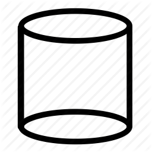

# DFD3
Data flow diagrams, also called DFDs or threat modeling diagrams.

## Goal
Many people have presented various different ways to craft data flow diagrams over the years.  This page defines a "v3 DFD" precisely. It also encourages people to think about diagramming techniques themselves as something that, like code, can be specified and evolved over time, and labeled with a version.

### Symbols/Elements used

| Element | Symbol | Discussion |
|---------|--------|------------|
| External entity|   | A sharp-cornered rectangle. Anything outside your control.  Examples include people and systems run by other organizations or even divisions.  For example, Joe's mobile phone, the Mint data aggregators (assuming you're modeling from a bank's perspective.).  If you're modeling Mint, then the bank's systems would be external entities. 
| Process|  | A rounded rectangle.  Any running code, including compiled, scripts, shell commands, SQL stored procedures, et cetera.
| Data store|   | A drum. Anywhere data is stored, including files, databases, shared memory, S3, cookies, et cetera.
| Data flows|  | An arrow. All the ways that processes can talk to data stores or each other.
| Trust boundary | . . . | A closed shape drawn with a dashed or dotted line. Usually a box.

## Definition
1. A V3 DFD uses 5 symbols.  
   1. A rectangle represents an external entity, a person or code outside your control. 
   2. A rounded rectangle represents a process. They're connected by arrows, which can be single or double headed.
   3. Data stores are represented by drums.
   4. Data flows are represented by arrows. These are usually two way (bi-directional). A dot can be used to represent the origination side.
   5. A trust boundary is a closed shape, usually a box.
2. All lines are solid, except those used for trust boundaries, which are dashed or dotted.  (There is no "multi-process" symbol in DFD3.)
3. It must not* depend on the use of color, but can use color for additional information.
4. All elements should have a label.
5. You may have a context diagram if the system is complex.  One is not required.
</ol>
* Must, must not, should, should not are used per IETF norms.

# Rationales

DFD3 is what people have come to call 'opinionated.' The design is aggressively simple to prioritize easy learning and use over expressiveness. It's just enough information to enable threat modeling and put type information into the picture.

## Rounded rectangles
Are more space-efficient in a large diagram than circles.

## Boxed boundaries
Clearly show what's inside, in a way that arcs often fail to do. Dashes and dots are clearly different from other elements and reproduce clearly with black and white printers.

## Double headed arrows
Are easier to draw.  They don't show initiation of a connection, which is sad, and that can be shown with one arrowhead filled, the other open.

## No "Complex Processes"
Some approaches refer to complex processes, indicated by a doubled (concentric) circle. When to use them was never made clear, and so they're a bit of a distraction and I recommend against them.

## Drums vs double lines
The drum is easier to draw and label with software drawing tools. The parallel lines in Yourdon and other early DFDs are trivial to draw using a physical stencil: You just draw the top and bottom of a rectangle. But with software, you draw the two lines, you add text, you maybe align the text, then you group them. So with software, adding a drum to a diagram is 2 actions (draw drum, label) while the classic doubles lines is 4-5.

## History and Relationships
I'm told that Gane and Sarson also used rounded rectangles long before me.  (Gane, Chris; Sarson, Trish. *Structured Systems Analysis: Tools and Techniques*, 1979.).  According to Richard Botting's CS372 [course notes](https://web.archive.org/web/20190915023802/http://www.csci.csusb.edu/dick/cs372/a4.html) Yourdon and De Marco also used sharp rectangles for external entities.
